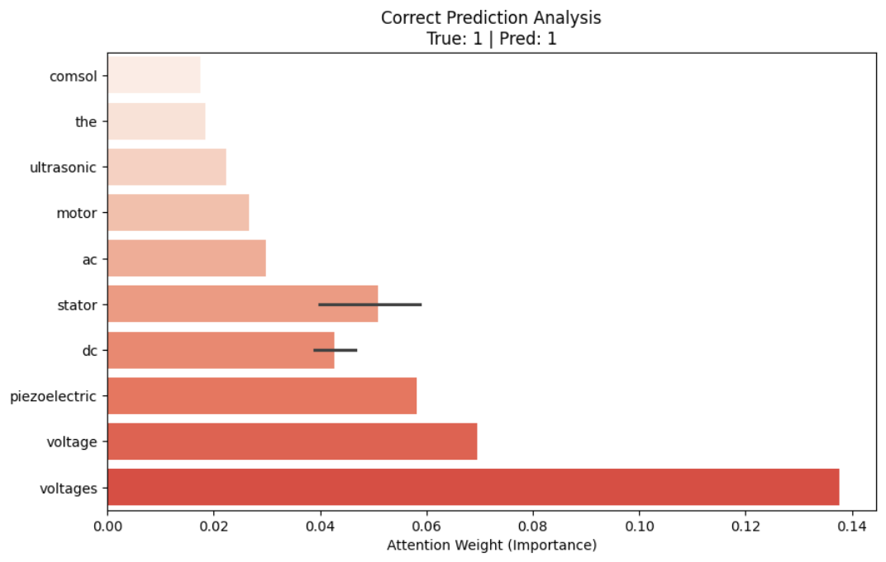
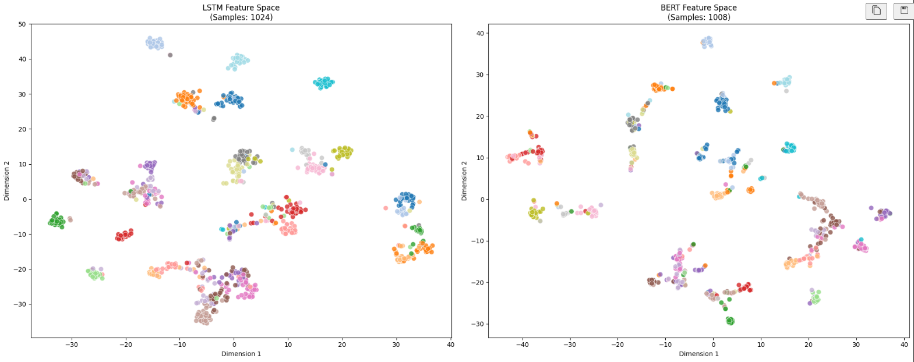

# Sequential Modeling vs. Transformers: Hierarchical NLP Classification

> **Portfolio Project** | Advanced NLP & Deep Learning | Comparative ML Research

## Project Summary

A comprehensive study comparing **custom-built sequential models** with **modern Transformer architectures** on hierarchical document classification. This project demonstrates proficiency in building deep learning models from first principles, fine-tuning state-of-the-art NLP architectures, and conducting rigorous comparative analysis.

**Dataset:** Web of Science (WOS11967) — 11,967 research papers with 2-level hierarchical labels (7 domains × 33 sub-fields)

## My Specific Contributions

- **Custom LSTM Implementation:** Developed a complete LSTM architecture from scratch using PyTorch tensors. This included the manual definition of input, forget, and output gates, cell state updates, and orthogonal weight initialization.
- **BERT Fine-Tuning:** Implemented a Transformer-based pipeline using `bert-base-uncased`. I optimized the model using the AdamW optimizer.
- **Comparative Evaluation Suite:** Developed a systematic benchmarking method using Pandas to compare LSTM and BERT across four key metrics: Accuracy and Macro F1-score for both hierarchical levels. I utilized Pandas styling to highlight top-performing models across metrics.
- **Automated Hyperparameter Tuning:** Integrated **Optuna** to conduct a Bayesian search for the LSTM, optimizing the hidden size, learning rate, and batch size to maximize the macro-averaged F1 score.

Based on the implementations above, the following insights and analyses were derived:

## Key Achievements

### 1. **Custom LSTM Built from Scratch**
- Implementation of complete LSTM architecture from first principles using PyTorch
- Manual definition of input, forget, and output gate mechanisms
- Cell state updates with proper gradient flow
- Orthogonal weight initialization for training stability

### 2. **BERT Fine-Tuning Pipeline**
- Leveraged `bert-base-uncased` pre-trained model for hierarchical classification
- Implemented fine-tuning strategy using AdamW optimize
- Integrated weighted Cross-Entropy Loss to handle class imbalance
- Demonstrated effectiveness over custom sequential models

### 3. **Rigorous Comparative Analysis**
- Systematic benchmarking suite comparing LSTM and BERT across:
  - Level 1 (Domain Classification): Accuracy & Macro F1-score
  - Level 2 (Sub-field Classification): Accuracy & Macro F1-score
- Pandas styling for visual performance comparison
- Reproducible evaluation metrics with train/validation/test splits

### 4. **Advanced Hyperparameter Optimization**
- Bayesian optimization framework using Optuna
- Systematic tuning of hidden size, learning rate, and batch size
- Objective optimization for macro-averaged F1-score
- Identified optimal configuration for improved performance

### Key Discoveries:
1. **Transformer Superiority:** BERT's bidirectional context and self-attention mechanism dramatically outperformed sequential processing for capturing complex document structure
2. **Class Imbalance Impact:** Weighted loss functions critical for balanced performance across 33 sub-field classes
3. **Attention Insights:** BERT concentrates attention on domain-specific terminology, validating learned representations

## Technical Stack

- **Deep Learning Framework:** PyTorch
- **Transformers:** Hugging Face `transformers` library (BERT)
- **Hyperparameter Tuning:** Optuna (Bayesian optimization)
- **Data Processing:** Pandas, NumPy, scikit-learn
- **Visualization:** Matplotlib, Seaborn
- **Metrics:** scikit-learn's accuracy, F1-score, class weight computation

## Project Structure

```
├── COMP_551_A4.ipynb          # Complete implementation notebook
├── Task 1: Data Loading & Exploration
├── Task 2: LSTM Implementation
│   ├── Custom LSTM from scratch
│   └── Training with Optuna optimization
├── Task 3: BERT Fine-tuning
│   ├── Tokenization & dataset preparation
│   └── Multi-task hierarchical training
├── Task 4: Comparative Analysis
│   ├── Performance metrics
│   └── Model comparison tables
└── Extra Experiments
    ├── Attention Visualization
    └── Feature Space Comparison (t-SNE)
```

## Experimental Visualizations

### Attention Analysis
Extracted and visualized BERT's self-attention patterns to identify which tokens the model emphasizes during classification.


*Top 15 most attended tokens from BERT's Layer 11, Head 0 for both correct and incorrect predictions*

### Feature Space Comparison
Applied t-SNE dimensionality reduction to compare the learned feature representations between LSTM and BERT models.


*2D projection of model representations colored by sub-field labels (33 classes)*


